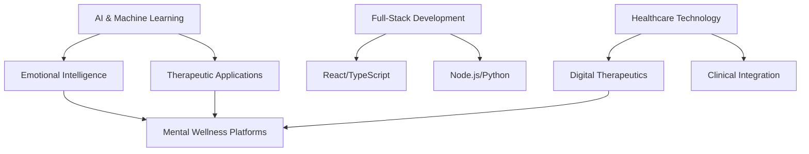

# Hi there, I'm Eva 👋

## 🚀 AI Systems Architect | Full-Stack Developer | Mental Health Tech Innovator

Welcome to my GitHub! I'm passionate about building technology that bridges the gap between artificial intelligence and human wellness. With 15+ years in technology and a unique background spanning enterprise systems, clinical healthcare, and cutting-edge AI development.

### 🔭 Currently Working On
- **AxisGPT** - Revolutionary emotional intelligence AI for shadow work and therapeutic integration
- **Focus Flow** - ADHD productivity platform with behavioral analytics and AI-powered insights
- **Therapeutic AI Systems** - Pioneering responsible AI applications for mental health and wellness

### 🌱 Currently Learning
- Advanced machine learning for emotional intelligence applications
- Digital therapeutics and evidence-based AI interventions
- Ethical AI development for healthcare and mental wellness

### 💻 Tech Stack
```javascript
const eva = {
    languages: ['JavaScript', 'TypeScript', 'Python', 'SQL'],
    frontend: ['React', 'Next.js', 'HTML5', 'CSS3', 'Tailwind'],
    backend: ['Node.js', 'Deno', 'Express', 'PostgreSQL', 'Supabase'],
    ai_ml: ['OpenAI GPT-4', 'Claude API', 'Pandas', 'NumPy', 'Scikit-learn'],
    cloud: ['Vercel', 'AWS', 'Docker', 'GitHub Actions'],
    specialties: ['Therapeutic AI', 'Emotional Intelligence Systems', 'Healthcare Technology']
};
```

### 🎯 What I'm Building
🧠 **Emotional Intelligence AI** - Creating AI systems that understand and support human emotional development  
📊 **Behavioral Analytics** - Data-driven insights for neurodiversity and mental wellness  
🏥 **Healthcare Technology** - Bridging clinical care experience with innovative tech solutions  
🎓 **Educational Platforms** - AI-powered learning systems for complex technology adoption

### 🤝 Looking to Collaborate On
- Mental health technology and digital therapeutics projects
- Responsible AI development for healthcare applications
- Open source tools for neurodiversity and accessibility
- Research in emotional intelligence and therapeutic AI systems

### 💬 Ask Me About
- Building AI systems for mental health and wellness
- Full-stack development with modern JavaScript/TypeScript
- Clinical healthcare experience and technology integration
- Large-scale technology implementation and training (12,000+ users)
- Transitioning from traditional tech roles to AI innovation

### 📫 How to Reach Me
- 🌐 **Portfolio**: [metawellnessai.com](https://metawellnessai.com)
- 🤖 **AI Platform**: [inkandshadowtales.com](https://inkandshadowtales.com)
- 💼 **LinkedIn**: [linkedin.com/in/eva-kagai](https://linkedin.com/in/eva-kagai)
- 📧 **Email**: info@inkandshadowtales.com
- 📝 **Blog**: [blog.inkandshadowtales.com](https://blog.inkandshadowtales.com)

### 🏆 Featured Projects

#### 🎭 [AxisGPT - Emotional Intelligence AI](https://inkandshadowtales.com)
Advanced conversational AI for shadow work, emotional integration, and therapeutic support. Built with React, TypeScript, and OpenAI GPT-4.

#### 📈 [Focus Flow - ADHD Analytics Platform](https://focusflow.metawellnessai.com)
Behavioral data platform helping ADHD individuals optimize productivity through AI-driven insights and personalized recommendations.

#### 🌐 [Professional Portfolio](https://metawellnessai.com)
Modern React portfolio showcasing the intersection of technology, AI, and human wellness.

### 📊 GitHub Stats


### 🌟 Fun Facts
⚡ Trained Mental health Nursing assisstant and shadow work practioner bringing clinical healthcare experience to AI development  
🎯 Trained 12,000+ professionals in complex technology systems across international contexts  
🧠 Pioneer in emotional intelligence AI and therapeutic technology applications  
🌍 Multilingual: English, Swahili (native), French (learning)  
🚀 Passionate about using technology to make mental health support more accessible and effective

### 🎨 Current Focus Areas


---

*"Building technology that understands, supports, and enhances human emotional well-being through responsible AI innovation."*


